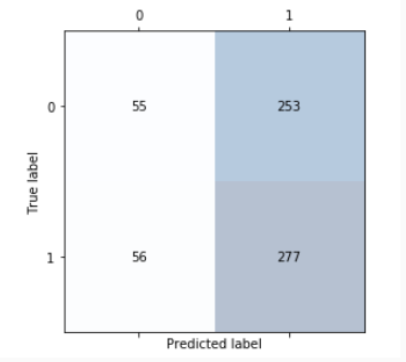

# Stock Price Prediction With Tweets

## Question : Can we predict Tesla stock prices from Elon Musk's twitter sentiment?
- "Emotions can profoundly influence individual behavior and decision making"
- "Business-related CEO tweets may be strongly correlated with positive movement of their company's stock prices"
- Goal : Use NLP & Deep Learning to predict stock prices

## Data
- Variables - 3,000 tweets from Elon Musk, from November 6th, 2012 to September 29th, 2017 via Kaggle
- Target - % change in stock price of Tesla via Alpha Vantage

## Visualization of Embedding Layers via Tensorboard
### Context of word "rocket" in relation to similar words

## Model Performane

## Explanatory Data Analysis

## Takeaways & Shortcoming
We did not have enough data to significantly increase the accuracy of our results. Going forward we are looking to get more data from other CEOs and influencers on twitter
